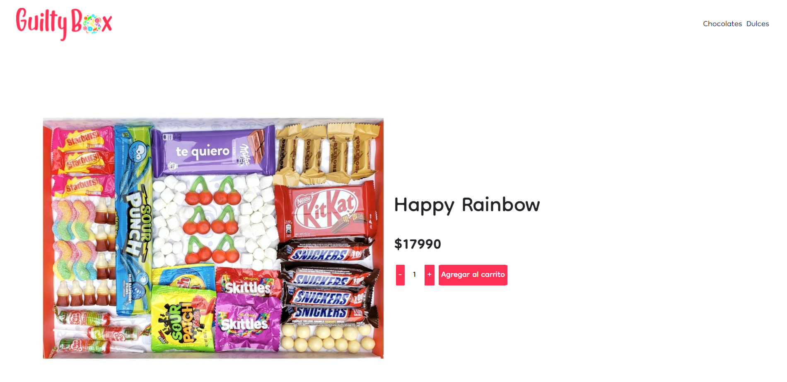

# Tienda GuiltyBox con React JS

Este proyecto fue realizado en base a React JS [Create React App](https://github.com/facebook/create-react-app).

# Librerias

## Boostrap 5

Usaremos Boostrap para generar estructuras de diseño de manera simple, ya que no son el foco principal de este proyecto.

## Firebase

Trabajaremos con Firebase para almacenar nuestra base de productos y registrar los pedidos.

# Documentación

## Flujo de compra
Cada cliente ingresará al home donde verá todos los productos. Podrá navegar por las diferentes categorías y luego elegir uno o varios productos para comprar. Al comprar podrá elegir las cantidades de el producto. Una vez que finaliza la compra, el sistema generará un id de pedido.

## Componentes

APP.JS: Incluye el rendering de toda la aplicación.
ItemListContainer: Trae todos los productos de la base de datos y genera todas las logicas de los productos que se deben mostrar, de acuerdo a las selecciones el cliente.
ItelList: genera un listado de todos los productos a mostrar.
Item: son los productos a mostrar en el catálogo.
ItemDetailContainer: Trae todos los productos de la base de datos y genera todas las logica del producto que se va a mostrar en detalle, cuando el cliente ingresa al producto a comprar.
ItemDetail: maneja la estructura del producto a mostrar en detalle.
Cart: se encarga de toda la logica del carro de compras y la venta final.
CartContext: es el context que usaremos para transmitir información de un componente a otro.
CartWidget: es el componente que muestra el carrito de compras y su lógica.

## Imagenes del proyecto

